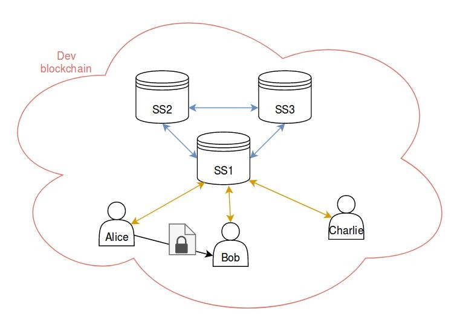

In this tutorial, we will learn step by step how to setup a Secret Store with 3 nodes and use it for a simple use case:

Alice has a confidential document stored locally on her hard-drive. She would like to encrypt it, store the encryption key in a secure way and eventually share the document later on.
Alice decides to share this encrypted document with Bob and Bob only.

To keep things simple we will work on a [Private development chain](Private-development-chain) but the Secret Store nodes are meant to be connected to and synchronize any blockchain (Private or Public).

The overall picture of this tutorial is the following:
- 3 Secret Store nodes (each with an account)
- 3 regular user accounts (Alice, Bob and Charlie)

- Each entity on this picture is running a node on the same blockchain. Interactions with the blockchain are not represented on this diagram.
- The nodes part of the secret store are connected with each other using a secure connection (blue lines).
- The Secret Store node 1 (SS1) exposed an HTTP API that Alice, Bob and Charlie can use to generate, store or retrieve encryption keys (orange lines).
- Alice will send an encrypted document to Bob per email (gray line).

The tutorial is partitioned in the following steps:

TODO

|[Next Step (Configuring each node) > ](Secret-Store-Tutorial-1)|

